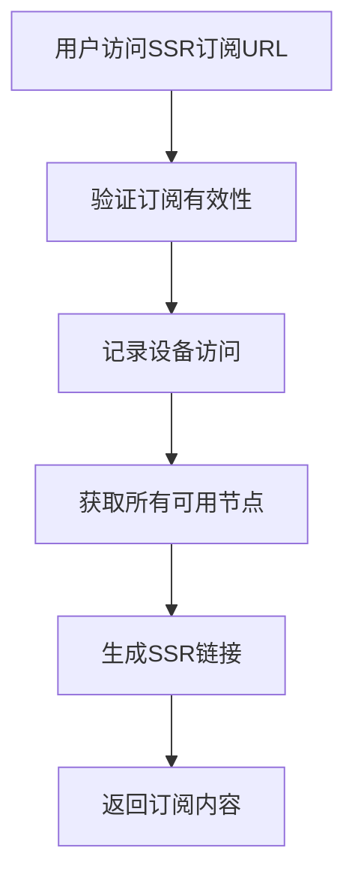
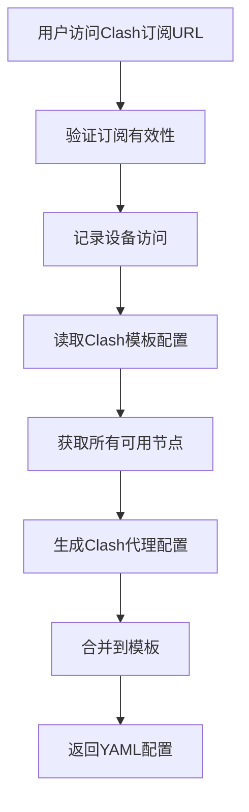

# XBoard Modern 配置文件管理说明

## 📁 配置文件存储位置

### 1. 订阅配置文件

#### 有效配置文件位置
```
uploads/config/
├── xr                    # xr 客户端配置文件
├── clash.yaml           # Clash 配置文件
└── work                 # Work 配置文件
```

#### 失效配置文件位置
```
uploads/config/
├── xr.backup           # xr 配置文件备份
├── clash.yaml.backup   # Clash 配置文件备份
└── work.backup         # Work 配置文件备份
```

### 2. 用户订阅文件

#### 动态生成的订阅文件
```
/api/v1/subscriptions/{subscription_id}/ssr    # SSR订阅内容
/api/v1/subscriptions/{subscription_id}/clash  # Clash订阅内容
```

## 🔧 配置文件引用方式

### 1. 静态配置文件引用

#### 在管理后台中引用
- **路径**: `/admin/config-files`
- **功能**: 查看、编辑、备份、恢复配置文件
- **支持格式**: 
  - `xr`: 纯文本格式
  - `clash.yaml`: YAML格式
  - `work`: 纯文本格式

#### 在代码中引用
```python
# 配置文件路径定义
CONFIG_DIR = Path("uploads/config")
XR_CONFIG_PATH = CONFIG_DIR / "xr"
CLASH_CONFIG_PATH = CONFIG_DIR / "clash.yaml"
WORK_CONFIG_PATH = CONFIG_DIR / "work"
```

### 2. 动态订阅文件引用

#### SSR订阅引用
```python
# 生成SSR订阅URL
ssr_url = f"{base_url}/api/v1/subscriptions/{subscription_id}/ssr"

# 生成SSR订阅内容
def generate_ssr_subscription(subscription):
    nodes = self.db.query(Node).filter(Node.is_active == True).all()
    ssr_lines = []
    for node in nodes:
        ssr_url = self._generate_ssr_url(node, subscription)
        ssr_lines.append(ssr_url)
    return "\n".join(ssr_lines)
```

#### Clash订阅引用
```python
# 生成Clash订阅URL
clash_url = f"{base_url}/api/v1/subscriptions/{subscription_id}/clash"

# 生成Clash订阅内容
def generate_clash_subscription(subscription):
    # 读取Clash模板配置
    template_path = Path("uploads/config/clash.yaml")
    if template_path.exists():
        with open(template_path, 'r', encoding='utf-8') as f:
            config = yaml.safe_load(f)
    else:
        config = self._get_default_clash_config()
    
    # 添加节点到配置
    nodes = self.db.query(Node).filter(Node.is_active == True).all()
    for node in nodes:
        proxy_config = self._generate_clash_proxy_config(node, subscription)
        config["proxies"].append(proxy_config)
    
    return config
```

## 📋 配置文件管理功能

### 1. 管理后台功能

#### 配置文件列表
- **API**: `GET /admin/config-files`
- **功能**: 显示所有配置文件的状态
- **返回信息**:
  - 文件名称
  - 文件路径
  - 文件大小
  - 修改时间
  - 是否存在

#### 查看配置文件内容
- **API**: `GET /admin/config-files/{file_name}`
- **功能**: 获取配置文件内容
- **支持文件**: `xr`, `clash.yaml`, `work`

#### 保存配置文件
- **API**: `POST /admin/config-files/{file_name}`
- **功能**: 保存配置文件内容
- **安全措施**:
  - 文件大小限制
  - PHP代码检测
  - YAML格式验证
  - 自动备份

#### 备份配置文件
- **API**: `POST /admin/config-files/{file_name}/backup`
- **功能**: 创建配置文件备份
- **备份位置**: 原文件名 + `.backup`

#### 恢复配置文件
- **API**: `POST /admin/config-files/{file_name}/restore`
- **功能**: 从备份恢复配置文件

### 2. 用户端功能

#### 获取订阅信息
- **API**: `GET /user-subscription`
- **功能**: 获取用户订阅状态和URL
- **返回信息**:
  - 订阅ID
  - 剩余天数
  - 到期时间
  - 设备数量
  - SSR/Clash订阅URL

#### 重置订阅地址
- **API**: `POST /reset-subscription`
- **功能**: 重置订阅密钥，清空设备记录

#### 发送订阅邮件
- **API**: `POST /send-subscription-email`
- **功能**: 发送订阅信息到用户邮箱

## 🔄 配置文件生成流程

### 1. SSR订阅生成流程



### 2. Clash订阅生成流程



## 🛡️ 安全措施

### 1. 文件访问控制
- 只有管理员可以修改配置文件
- 用户只能访问自己的订阅文件
- 订阅文件需要验证有效性

### 2. 内容安全
- 禁止写入PHP代码
- 文件大小限制
- YAML格式验证
- 自动备份机制

### 3. 设备管理
- 设备指纹识别
- 设备数量限制
- 设备访问记录
- 设备移除功能

## 📊 配置文件状态监控

### 1. 文件状态检查
```python
def check_config_files():
    files_to_check = [
        {"name": "xr", "path": XR_CONFIG_PATH, "description": "xr 客户端配置文件"},
        {"name": "clash.yaml", "path": CLASH_CONFIG_PATH, "description": "Clash 配置文件"},
        {"name": "work", "path": WORK_CONFIG_PATH, "description": "Work 配置文件"}
    ]
    
    for file_info in files_to_check:
        path = file_info["path"]
        if path.exists():
            # 文件存在，获取详细信息
            size = path.stat().st_size
            modified_time = path.stat().st_mtime
        else:
            # 文件不存在
            size = 0
            modified_time = None
```

### 2. 订阅状态监控
```python
def get_subscription_stats():
    total = self.db.query(Subscription).count()
    active = len(self.get_active_subscriptions())
    expired = len(self.get_expired_subscriptions())
    
    return {
        "total": total,
        "active": active,
        "expired": expired,
        "active_rate": (active / total * 100) if total > 0 else 0
    }
```

## 🔧 配置文件模板

### 1. Clash配置文件模板
```yaml
port: 7890
socks-port: 7891
allow-lan: true
mode: Rule
log-level: info
external-controller: :9090

proxies:
  - name: "节点名称"
    type: ssr
    server: "服务器地址"
    port: 443
    cipher: chacha20
    password: "密码"
    protocol: origin
    protocol-param: ""
    obfs: plain
    obfs-param: ""

proxy-groups:
  - name: Proxy
    type: select
    proxies: ["节点名称"]

rules:
  - MATCH,Proxy
```

### 2. SSR配置文件模板
```
# SSR节点配置
# 格式: ssr://server:port:protocol:method:obfs:password/?obfsparam=&protoparam=&remarks=&group=

# 示例节点
ssr://example.com:443:origin:chacha20:plain:password/?obfsparam=&protoparam=&remarks=Example&group=Default
```

## 📝 使用说明

### 1. 管理员操作
1. 登录管理后台
2. 进入"配置管理"页面
3. 选择要编辑的配置文件
4. 修改配置内容
5. 保存并备份

### 2. 用户操作
1. 登录用户后台
2. 查看订阅信息
3. 复制订阅URL
4. 在客户端中导入

### 3. 客户端配置
1. **Clash客户端**:
   - 打开Clash
   - 点击"配置"
   - 添加订阅URL
   - 更新配置

2. **SSR客户端**:
   - 打开SSR客户端
   - 扫描二维码或输入订阅URL
   - 选择节点连接

## 🔍 故障排除

### 1. 配置文件不存在
- 检查文件路径是否正确
- 确认文件权限设置
- 重新创建配置文件

### 2. 订阅无法访问
- 检查订阅是否过期
- 确认设备数量限制
- 验证订阅密钥

### 3. 配置格式错误
- 检查YAML语法
- 验证配置文件结构
- 使用备份恢复

### 4. 设备连接问题
- 检查设备指纹
- 确认设备数量限制
- 重置订阅地址 